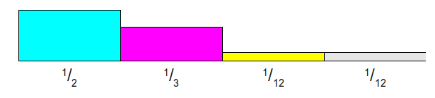
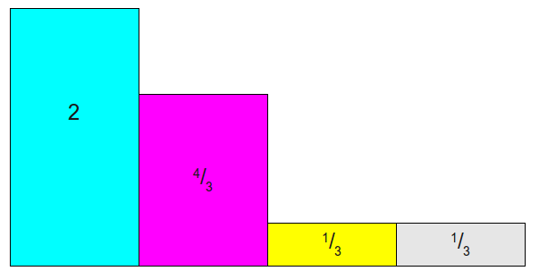
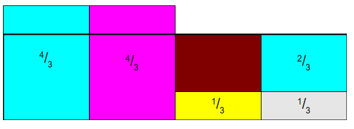
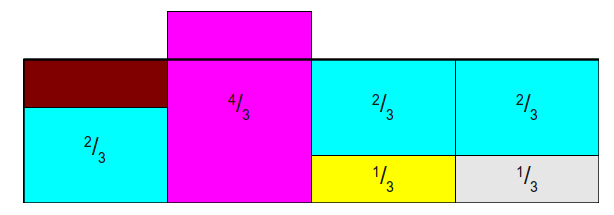
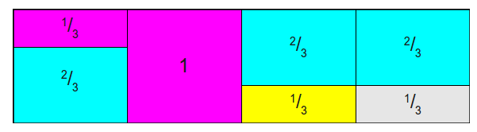
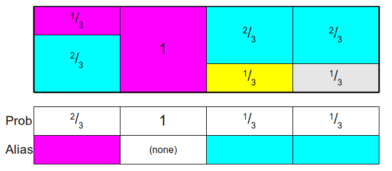

<h1>
    Alias-Method Sampling
</h1>

>Written by KaelThas_Infi

首先有这样一个问题：你有一个$n$面的骰子，对于第$i$面有$p_i$的投掷概率，那么有没有一个最有效的数据结构来模拟骰子的投掷？
其实这个问题可以类比为对离散的概率分布进行采样，即我们需要求一个骰子掷出来的连续序列满足上述概率。离散的概率分布采样最简单的就是用$uniform(0,1)$随机生成器采样，随机生成某个值落在哪个区间内就是采样值，例如$p_1=0.25,p_2=0.2,p_3=0.1,p_4=0.05,p_5=0.4$，然后构建一个累加概率分布表：$[0.25,0.45,0.55,0.60,1.0]$最直接的方法是生成一个在$[0,1]$范围内的随机数，然后一次与列表中的比较，复杂度为$O(K)$($K$为骰子面数)，显然我们可以用二分搜索，那么复杂度可以降为$O(logK)$。但其实我们还可以用一种更快的方法使得采样复杂度降为$O(1)$，即为$Alias-Method$。
举个例子来说明具体做法：
假设概率分布为$\frac{1}{2},\frac{1}{3},\frac{1}{12},\frac{1}{12}$
1.初始概率分布：类别数目$K=4$,以颜色表示不同的类别

2.每个类别概率乘以$K=4$，使得总和为4，这样分为两类：概率大于1；概率小于1。

3.下面通过拼凑，使得每一列的和均为1，但是每一列中，最多只能是两种类型的拼凑，就是每一列**最多两种颜色**存在。

- 将第一列拿出$\frac{2}{3}$给第四列，使之变为1，如下:

- 将第一列拿出$\frac{2}{3}$给第三列，使之变为1，如下:

- 最后一次把第二列拿出$\frac{1}{3}$给第一列，最后每一列都是1，且每一列最多两种类型，其中下面一层表示原类的概率，上面一层表示另一种类型的概率，如果只有一种比如第二列，那么另一种的概率就是0：

4.两个数组：
- **probability table** $Prob$:落在原类型的概率，$[\frac{2}{3},1,\frac{1}{3},\frac{1}{3}]$
- **Alias table** $Alias$:第二层的类型(颜色)，$[2,null,1,1]$

到此$Alias-Method$的初始化完成。
5.采样过程:随机取某一列$k$(即$[1,4]$随机整数)，在随机产生一个$[0,1]$的小数$c$，如果$Prob[k]$大于$c$，那么采样结果就是$k$，反之为$Alias[k]$。
建表复杂度为$O(K)$，之后采样复杂度为$O(1)$，并且对于所有类型的概率满足原来的概率分布。