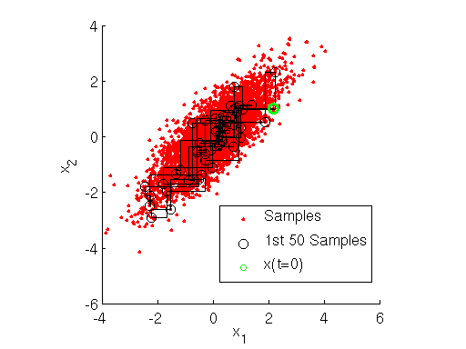

<h1>
    Gibbs采样
</h1>

>Written by KaelThas_Infi

1.**高维数据找寻合适的细致平稳条件**
$\quad$从二维数据分布开始，假设$\pi(x_1,x_2)$是一个二维联合数据分布，观察第一个特征维度相同的两个点$A(x_1^{(1)},x_2^{(1)})B(x_1^{(1)},x_2^{(1)})$容易发现下面两式成立.
$\quad\pi(x_1^{(1)},x_2^{(1)})\pi(x_2^{(2)}|x_1^{(1)})=\pi(x_1^{(1)})\pi(x_2^{(1)}|x_1^{(1)})\pi(x_2^{(2)}|x_1^{(1)})$
$\quad\pi(x_1^{(1)},x_2^{(2)})\pi(x_2^{(1)}|x_1^{(1)})=\pi(x_1^{(1)})\pi(x_2^{(2)}|x_1^{(1)})\pi(x_2^{(1)}|x_1^{(1)})$
由于两式右边相等$\Rightarrow\pi(x_1^{(1)},x_2^{(1)})\pi(x_2^{(2)}|x_1^{(1)})=\pi(x_1^{(1)},x_2^{(2)})\pi(x_2^{(1)}|x_1^{(1)})\Rightarrow\pi(A)\pi(x_2^{(2)}|x_1^{(1)})=\pi(B)\pi(x_2^{(1)}|x_1^{(1)})$
观察上式，再观察细致平稳条件的公式，我们发现在$x_1=x_1^{(1)}$这条直线上，如果用条件概率分布$\pi(x_2|x_1^{(1)})$作为马尔可夫链的状态转移概率，则任意两个点之间满足细致平稳条件。同理在$x_2=x_2^{(1)}$这条直线上，用条件概率分布$\pi(x_1|x_2^{(1)})$作为马尔可夫链的状态转移概率，则任意两个点之间的转移也满足细致平稳条件。有另一点 $C(x_1^{(2)},x_2^{(1)})$我们可以得到$\Rightarrow\\\pi(A)\pi(x_1^{(2)}|x_2^{(1)})=\pi(C)\pi(x_1^{(1)}|x_2^{(1)})$基于上面的发现，我们可以这样构造分布$\pi(x_1,x_2)$的马尔可夫链对应的状态转移矩阵$\\P:P(A\rightarrow B)=\pi(x_2^{(B)}|x_1^{(1)})\quad if\quad x_1^{(A)}=x_1^{(B)}=x_1^{(1)}\\\quad \ \ P(A\rightarrow C)=\pi(x_1^{(C)}|x_2^{(1)})\quad if\quad x_2^{(A)}=x_2^{(C)}=x_2^{(1)}\\\quad \ \ P(A\rightarrow D)=0\quad \quad \quad \quad \quad \ else$
有了上面这个这个状态转移矩阵，我们很容易验证平面上的任意两点$E,F$满足细致平稳条件：$\pi(E)P(E\rightarrow F)=\pi(F)P(F\rightarrow E)$
2.**二维Gibbs采样**
具体过程:
$1)$输入平稳分布$\pi(x_1,x_2)$，设定状态转移次数阈值$n_1$，需要样本个数$n_2$
$2)$随机初始化初始状态值$x_1^{(0)}x_2^{(0)}$
$3)for \ \ t = 0 \ \ to  \ \ n_1+n_2-1 $
$\ \ \ \ a)$从条件概率分布$P(x_2|x_1^{(t)})$采样得到样本$x_2^{t+1}$
$\ \ \ \ b)$从条件概率分布$P(x_1|x_2^{(t+1)})$采样得到样本$x_1^{t+1}$
样本集$\lbrace (x_1^{n_1},x_2^{n_1}),(x_1^{n_1+1},x_2^{n_1+1}),……(x_1^{n_1+n_2-1}，x_2^{n_1+n_2-1})\rbrace$即为我们需要的聘问分布对应的样本集。
整个采样过程我们通过轮换坐标轴，采样过程为：
$(x_1^{(1)},x_2^{(2)})\rightarrow (x_1^{(1)},x_2^{(2)})\rightarrow(x_1^{(2)},x_2^{(2)}\rightarrow ……\rightarrow (x_1^{(n_1+n_2-1)},x_2^{(n_1+n_2-1)})$

由上图可以直观看出，采样是在两个坐标轴上不停轮换的，当然坐标轴轮换并非必须，也可以随机选择一个坐标轴进行采样。
3.**推广至多维**
例如一个$n$维的概率分布$\pi(x_1,x_2,……x_n)$,通过$n$个坐标轴轮换采样来得到新的样本,对于轮换到任意一个坐标轴的$x_i$上的转移，马尔可夫链的状态转移概率为$P(x_i|x_1,x_2,……x_{i-1},x_{i+1}……x_n)$即固定$n-1$个坐标轴，在某一个坐标轴上移动。
$1)$输入平稳分布$\pi(x_1,x_2,……x_n)$或者对应的所有特征的条件概率分布，设定状态转移的阈值为$n_1$，所需要的样本个数为$n_2$。
$2)$随机初始化状态值 $x_1^{(0)},x_2^{(0)}……x_n^{(0)}$
$3)for\ \ t = 0\ \ to \ \ n_1+n_2-1$
$\ \ a)$从条件概率分布$P(x_1|x_2^{(t)},x_3^{(t)},……x_n^{(t)})$中采样得到样本$x_1^{t+1}$
$\ \ b)$从条件概率分布$P(x_2|x_1^{(t+1)},x_3^{(t)},……x_n^{(t)})$中采样得到样本$x_2^{t+1}$
$\ \ c)$$………………………………$
$\ \ d)$从条件概率分布$P(x_j|x_1^{(t+1)},……x_{j-1}^{(t+1)},x_{j+1}^{(t)},……x_n^{(t)})$中采样得到样本$x_j^{t+1}$
$\ \ e)$$………………………………$
$\ \ f)$从条件概率分布$P(x_n|x_1^{(t+1)},……x_{n-1}^{(t+1)})$中采样得到样本$x_n^{t+1}$
样本集$\lbrace (x_1^{(n_1)},x_2^{(n_1)},……x_n^{(n_1)}),…………(x_1^{(n_1+n_2-1)},……x_n^{(n_1+n_2-1)})\rbrace$
整个采样过程和$Lasso$回归的坐标轴下降算法有点相似，只不过一个是固定$n-1$个特征，求剩下一个的极值，而$Gibbs$是对另一个特征进行采样。当然轮换坐标轴并非必须，可以随机选择某一个坐标轴进行状态转移。

(过采样($over-Sampling$):扩大数据规模，增加了模型训练的复杂度，造成过拟合)
(欠采样($under-Sampling$):会丢弃一些样本，可能损失部分有用信息，造成模型仅学习到整体模式的一部分)